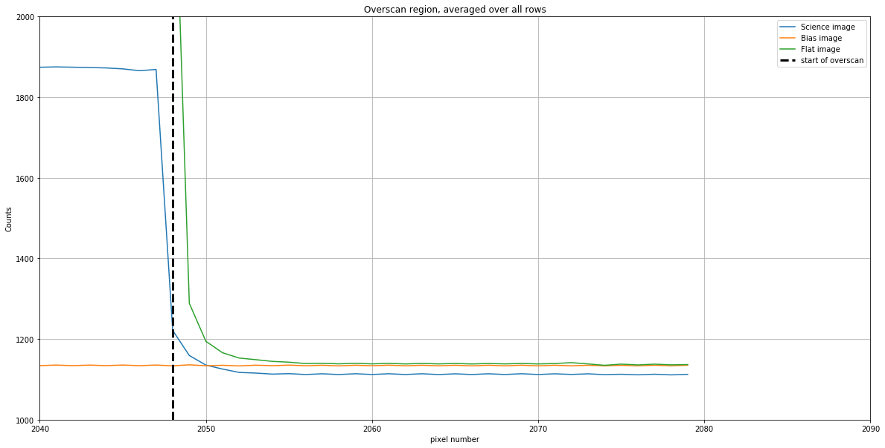
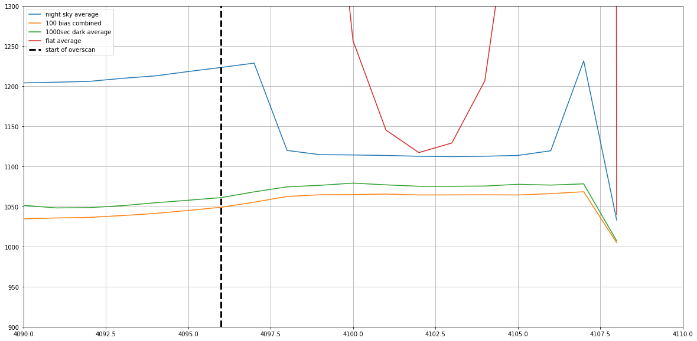

---
redirect_from:
  - "01-08-overscan"
interact_link: content/01-08-Overscan.ipynb
kernel_name: python3
has_widgets: false
title: 'Overscan'
prev_page:
  url: /01-06-Image-combination
  title: 'Image combination'
next_page:
  url: /01-09-Calibration-choices-you-need-to-make
  title: 'Calibration choices to make'
comment: "***PROGRAMMATICALLY GENERATED, DO NOT EDIT. SEE ORIGINAL FILES IN /content***"
---

# Overscan

The overscan region of a CCD, if present, is a part of the chip that is covered. Depending on the camera, it can be a useful way to remove small variations in the bias level from frame to frame.

However, whether or not the overscan is useful depends on the camera. It's advisable to examine the overscan part of the camera you're using before deciding if you should include it in image reduction.

One important note: *overscan always includes bias, read noise, and dark current*. The overscan pixels are still pixels, and just like any other pixel includes dark current and is subject to read noise. Many sources describe overscan as correcting for bias, but if the dark current for the camera is negligible, as it often is for cryogenically cooled cameras, then the overscan is essentially bias.

The read noise in the overscan is reduced by averaging over the overscan region. That will be covered in a later notebook; this notebook focuses on what the overscan looks like and how to decide whether or not to use it.

In this notebook we will look at the overscan region for two different cameras, a cryogenically cooled camera in which the overscan provides useful information and a thermo-electrically cooled camera in which the overscan does not provide useful information.


{:.input_area}
```python
from astropy.nddata import CCDData
from astropy.visualization import hist
from ccdproc import subtract_overscan
import matplotlib.pyplot as plt

from convenience_functions import show_image

download_base_url = 'http://physics.mnstate.edu/craig/ccd-guide/'
```


## Case 1: Cryogenically cooled Large Format Camera (LFC) at Palomar

The images below are from chip 0 of the LFC at the Palomar 200-inch telescope. Technical information about the camera is [here](http://www.astro.caltech.edu/palomar/observer/200inchResources/lfcspecs.html). It turns out that the images are not actually 2048 × 4096; as you can see below, the images are 2080 × 4128. The "extra" in each direction is overscan. 

The FITS header for these files includes the keyword `BIASSEC`, which indicates the nominal extent of the overscan region. Its value is `[2049:2080,1:4127]`, which indicates the overscan extends from 2048 to 2079 (Python indexing starts at 0, not 1 like in FITS) in the "short" direction and over the entire chip in the other direction. As we'll see shortly, the useful overscan region is smaller than this.

We'll focus here on the overscan in the side that is nominally 2048 wide; in Python that's the second index. The pixel count cross-sections plotted below are from a bias, science, and flat image. Flat images are particularly helpful in evaluating how much of the overscan region is useful because the average pixel value in the exposed part of the camera is typically large.


{:.input_area}
```python
bias_lfc = CCDData.read('python_imred_data/ccd.001.0.fits.gz', unit='count')
science_g_lfc = CCDData.read('python_imred_data/ccd.037.0.fits.gz', unit='count')
flat_g_lfc = CCDData.read('python_imred_data/ccd.014.0.fits.gz', unit='count')
```


{:.input_area}
```python
bias_lfc.shape
```


{:.output .output_data_text}
```
(4128, 2080)
```


{:.input_area}
```python
plt.figure(figsize=(20,10))
plt.plot(science_g_lfc.data.mean(axis=0), label='Science image')
plt.plot(bias_lfc.data.mean(axis=0), label='Bias image')
plt.plot(flat_g_lfc.data.mean(axis=0), label='Flat image')
plt.grid()
plt.axvline(x=2048, color='black', linewidth=3, linestyle='dashed', label='start of overscan')
plt.legend()
plt.ylim(1000, 2000)
plt.xlim(2040, 2090)
plt.xlabel('pixel number')
plt.ylabel('Counts')
plt.title('Overscan region, averaged over all rows')
```


{:.output .output_data_text}
```
Text(0.5, 1.0, 'Overscan region, averaged over all rows')
```


{:.output .output_png}



### Discussion

There are a few interesting things here.

#### The count value is nearly uniform in the overscan region.

This is good; ideally the overscan is nearly uniform since the pixels are not illuminated.

#### Some light leaks from the imaging region into the overscan region. This is clearest in the flat image, where the counts are much higher than the value to which they asymptote until at least pixel number 2055.

Though the FITS header indicates the overscan starts at pixel 2048, the *useful* part of the overscan (i.e. the part not contaminated by light) extends from pixel 2055 to the end.

#### There is an offset between the science image and the other two images, and perhaps between the flat and bias images.

This sort of variation is what overscan is intended to correct. It could be that this one science image has a different overscan value (it was taken several hours after the flat image) or it could be that all science images have a different overscan value than other types of images.

Either way, subtracting overscan from each of the images allows for correction of these offsets.

#### Dark current *in this camera* is essentially zero so the overscan is measuring bias

To be clear, this isn't apparent from the graph above, but cryogenically cooled cameras have negligible dark current. 

#### What happens if you don't use the overscan?

Nothing particularly bad. In the specific case above, ignoring the overscan will shift the background level in the science image by roughly 20 counts, since the difference between the overscan region of the science image is lower than the overscan in the other images by roughly 20 counts. If, before doing science, the background of those images is subtracted, then this shift should be removed with the background.

### Conclusion for case 1

The overscan is useful, but the usable overscan region extends from 2055 to the end of the chip rather than from 2048 to end of the chip as the FITS header claims. Put a little differently, the appropriate `BIASSEC` for these images is `[2056:2080,1:4127]`. (Note that FITS starts numbering at 1 instead of 0, so 2055 in Python is 2056 in FITS notation.)

If the science you are using requires knowing the counts to a precision of a count or two, and modeling the background in the science image isn't an option, consider using the overscan.

## Case 2: Thermo-electrically cooled Apogee Aspen CG16M

This is a low-end, research-grade CCD sold by Andor. Basic information is [here](https://andor.oxinst.com/assets/uploads/documents/Andor/apogee/Apogee_Aspen_CG16M_Specifications.pdf), though you need to track down the description of the sensor chip, [KAF-16803 CCD](http://www.onsemi.com/pub/Collateral/KAF-16803-D.PDF) to find out that the overscan region of this 4096 × 4096 pixel camera extends from pixel 4097 to 4109 along one of the directions.


{:.input_area}
```python
wasp = CCDData.read(download_base_url + 'wasp-10-b-S001-R001-C041-r.fit.gz', unit='adu')
dark1000 = CCDData.read(download_base_url + 'dark-test-0002d1000.fit.gz', unit='adu')
flat = CCDData.read(download_base_url + 'AutoFlat-PANoRot-r-Bin1-006.fit.gz', unit='adu')
master = CCDData.read(download_base_url + 'master_bias.fit.gz', unit='adu')
```


{:.output .output_stream}
```
INFO: using the unit adu passed to the FITS reader instead of the unit adu in the FITS file. [astropy.nddata.ccddata]
INFO: using the unit adu passed to the FITS reader instead of the unit adu in the FITS file. [astropy.nddata.ccddata]
INFO: using the unit adu passed to the FITS reader instead of the unit adu in the FITS file. [astropy.nddata.ccddata]

```


{:.input_area}
```python
plt.figure(figsize=(20,10))

plt.plot(wasp.data.mean(axis=0), label='night sky average')
plt.plot(master.data.mean(axis=0), label='100 bias combined')
plt.plot(dark1000.data.mean(axis=0), label='1000sec dark average')
plt.plot(flat.data.mean(axis=0), label='flat average')

plt.grid()
plt.axvline(x=4096, color='black', linewidth=3, linestyle='dashed', label='start of overscan')
plt.legend()
plt.xlim(4090, 4110)
plt.ylim(900, 1300)
```


{:.output .output_data_text}
```
(900, 1300)
```


{:.output .output_png}



### Discussion

The camera also has some interesting features.

#### Count values change quite a bit in the overscan region

This is clearest in the overscan for the flat. Not only is light leaking into the overscan, the overscan appears to be mostly light leakage. One pixel may be useful at best.

#### Overscan includes dark current

The overscan for the dark image in the figure above is roughly 10 counts higher than the counts for the bias. The dark current for this camera is roughly 0.01 counts/pixel/second. For a 1000 second dark exposure, the expected dark counts are about 10, which is the difference seen in the graph.

#### There is an offset between the bias/dark and science/flat images

The offset in this camera is roughly 50 counts. It's large enough that one ought to be hesitant to use the overscan for this camera.

#### The overscan counts are higher than the average bias counts

Note that for the bias image, counts increase up to the pixel where overscan starts and then level out. It turns out that overscan counts are *higher* than the average of the bias counts, so subtracting the overscan would lead to a bias image that is negative. This is another reason to be suspicious of the overscan region on this camera.

### Conclusion for case 2

Do not use the overscan in this case. There are serious issues with light leakage and large differences in the overscan counts between the bias and science images. 
