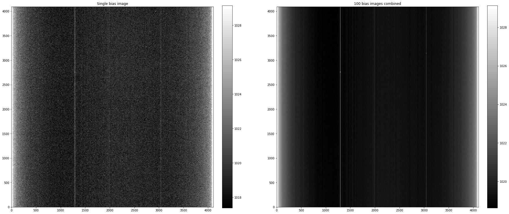
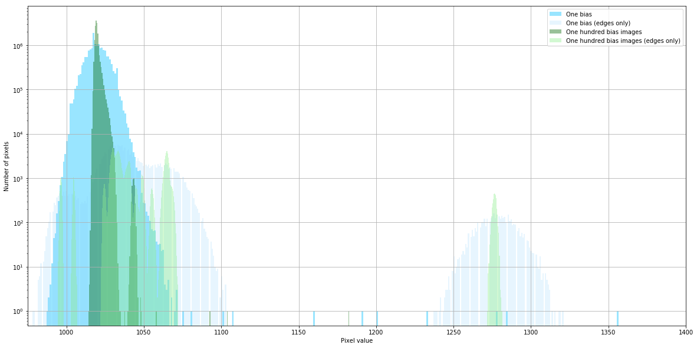

---
redirect_from:
  - "02-00-handling-overscan-trimming-and-bias-subtraction"
interact_link: content/02-00-Handling-overscan-trimming-and-bias-subtraction.ipynb
kernel_name: python3
has_widgets: false
title: 'Overscan and bias images'
prev_page:
  url: /01-11-reading-images
  title: 'Reading images'
next_page:
  url: /02-01-Calibrating-bias-images
  title: 'Calibrating bias images'
comment: "***PROGRAMMATICALLY GENERATED, DO NOT EDIT. SEE ORIGINAL FILES IN /content***"
---

# Handling overscan, trimming, and bias subtraction


## Introduction

The bias in a CCD camera is a DC offset applied to all pixels so that when the voltage in each pixel is converted to a number the number will always be positive. In an ideal CCD the bias would be the same for every pixel and not change over time. In practice, the bias is slightly different for each pixel, and can vary by a count or two from night to night or during a night.

A bias *image* is a picture taken with the shutter closed and zero exposure time; think about it as a command to the camera to do whatever it usually does to prepare the camera's electronics to take an image and then immediately read out the CCD as though you had taken a picture.

## Sample bias images

The images below are a single bias frame and an average 100 bias frames from an [Andor Apogee Aspen CG16M](http://www.andor.com/pdfs/specifications/Apogee_Aspen_CG16M_Specifications.pdf), a low-end 4k × 4k CCD with a [Kodak KAF-16803 sensor chip](http://www.onsemi.com/pub/Collateral/KAF-16803-D.PDF). That model camera has a typical bias level around 1000 and read noise around 10 $e^-$, though the precise value varies from camera to camera and with temperature.


{:.input_area}
```python
%load_ext autoreload
%autoreload 2
```


{:.input_area}
```python
%matplotlib inline
import matplotlib.pyplot as plt
```


{:.input_area}
```python
from astropy.nddata import CCDData
from astropy.visualization import hist

import numpy as np

from convenience_functions import show_image

download_base_url = 'http://physics.mnstate.edu/craig/ccd-guide/'
```


{:.input_area}
```python
one_bias = CCDData.read(download_base_url + 'dark-test-0100bias.fit.gz', unit='adu')
one_hundred_bias = CCDData.read(download_base_url + 'master_bias.fit.gz', unit='adu')
```


{:.output .output_stream}
```
INFO: using the unit adu passed to the FITS reader instead of the unit adu in the FITS file. [astropy.nddata.ccddata]

```


{:.input_area}
```python
fig, (ax_1_bias, ax_avg_bias) = plt.subplots(1, 2, figsize=(30, 15))

show_image(one_bias.data, cmap='gray', ax=ax_1_bias, fig=fig, input_ratio=8)
ax_1_bias.set_title('Single bias image')
show_image(one_hundred_bias.data, cmap='gray', ax=ax_avg_bias, fig=fig, input_ratio=8)
ax_avg_bias.set_title('100 bias images combined');
```


{:.output .output_png}



### Note a few things

+ The bias level in this specific camera is about 1023 (the mid-range of the colorbar).
+ The image is brighter on the left and right edges. This "amplifier glow" is frequently present and caused by the CCD electronics (photosensors with an applied voltage are LEDs).
+ There are several vertical lines; these are columns for which the bias level is consistently higher.
+ There is noticeable "static" in the images; that is read noise.
+ None of the variations are particularly large. 
+ Combining several bias images vastly reduces the read noise. This example is a little unrealistic in that 100 bias images were combined but does illustrate the idea that combining images reduces noise.

## Impact of combining images on noise

As discussed at length in the [notebook on combination](01.06-Image-combination.ipynb), the reason for taking and combining several calibration images is to reduce the noise if the images used for calibration. The difference between a single image and a combination of images is apparent in the images above. Another way to see the impact of combining images in the histogram of pixel values. Notice that the distribution of values is much narrower for the combined image than for a single bias. Pixels near the edges, where the amplifier glow is large, are binned separately from the rest of the pixels to emphasize the uniformity of the chip away from the glow.


{:.input_area}
```python
plt.figure(figsize=(20, 10))
hist(one_bias.data[:, 15:-30].flatten(), bins=800, alpha=0.4, label='One bias', color='deepskyblue')
hist(np.concatenate((one_bias.data[:, :15].flatten(), one_bias.data[:, -30:].flatten())), bins=400, alpha=0.2, label='One bias (edges only)', color='lightskyblue')
#hist(, bins=800, alpha=0.2, label='One bias (edges only)', color='darkblue')
hist(one_hundred_bias.data[:, 15:-30].flatten(), bins=800, alpha=0.4, label='One hundred bias images', color='darkgreen')
hist(np.concatenate((one_hundred_bias.data[:, :15].flatten(), one_hundred_bias.data[:, -30:].flatten())), bins=800, alpha=0.4, label='One hundred bias images (edges only)', color='lightgreen')

#hist(one_hundred_bias.data[:, :15].flatten(), bins=800, alpha=0.4, label='One hundred bias images', color='darkgreen')

plt.grid()
plt.xlim(975, 1400)
plt.legend()
plt.xlabel('Pixel value')
plt.ylabel('Number of pixels')
plt.semilogy();
```


{:.output .output_png}



## Bias calibration  overview

The progression here is to "calibrate" the bias images by subtracting overscan, if desired, trim the overscan from the bias images if it is present, and combine all of the bias images to make a "combined" bias (another common term for these images is "master" bias and occasionally "super" bias). 
