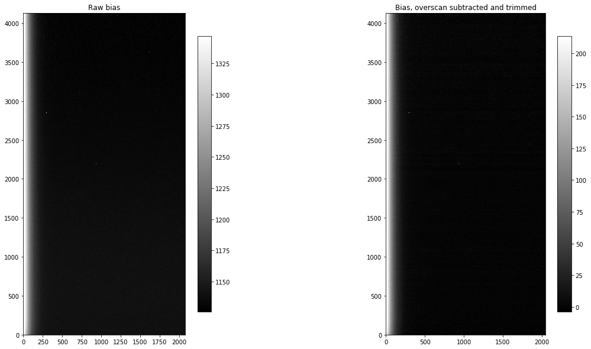

---
redirect_from:
  - "02-01-calibrating-bias-images"
interact_link: content/02-01-Calibrating-bias-images.ipynb
kernel_name: python3
has_widgets: false
title: 'Calibrating bias images'
prev_page:
  url: /02-00-Handling-overscan-trimming-and-bias-subtraction
  title: 'Overscan and bias images'
next_page:
  url: /02-04-Combine-bias-images-to-make-master
  title: 'Combinge bias images to make master bias'
comment: "***PROGRAMMATICALLY GENERATED, DO NOT EDIT. SEE ORIGINAL FILES IN /content***"
---

# Calibrating bias images

The purpose of calibrating bias images is three-fold:

+ Subtract overscan if you have decided your science will be better if you subtract overscan. See [this discussion of overscan](01.08-Overscan.ipynb) for some guidance. 
+ Trim the overscan region off of the image if it is present, regardless of whether you have chosen to subtract the overscan.
+ Combine the bias images into a "combined" bias to be used in calibrating the rest of the images. The purpose of combining several images is to reduce as much as possible the read noise in the combined bias.

The approach in this notebook will be to reduce a single image, look at the effects the reduction step had on that image and then demonstrate how to calibrate a folder containing several images of that type.


{:.input_area}
```python
from pathlib import Path
import os

from astropy.nddata import CCDData
from astropy.visualization import hist
import ccdproc as ccdp
import matplotlib.pyplot as plt
import numpy as np

from convenience_functions import show_image
```


 ## Decide where to put your calibrated images
 
Though it is possible to overwrite your raw data with calibrated images that is a bad idea. Here we create a folder called `reduced` that will contain the calibrated data and create it if it doesn't exist.


{:.input_area}
```python
calibrated_data = Path('.', 'reduced')
calibrated_data.mkdir(exist_ok=True)
```


## Example with overscan subtraction

### Data for this example

The data for this example can be downloaded from http://www.stsci.edu/~etollerud/python_imred_data.tar


{:.input_area}
```python
files = ccdp.ImageFileCollection('python_imred_data')
```


{:.input_area}
```python
files.summary['file', 'imagetyp', 'filter', 'exptime', 'naxis1', 'naxis2']
```


<div markdown="0" class="output output_html">
<i>Table masked=True length=14</i>
<table id="table47631692520" class="table-striped table-bordered table-condensed">
<thead><tr><th>file</th><th>imagetyp</th><th>filter</th><th>exptime</th><th>naxis1</th><th>naxis2</th></tr></thead>
<thead><tr><th>str17</th><th>str9</th><th>str2</th><th>float64</th><th>int64</th><th>int64</th></tr></thead>
<tr><td>ccd.001.0.fits.gz</td><td>BIAS</td><td>i&apos;</td><td>0.0</td><td>2080</td><td>4128</td></tr>
<tr><td>ccd.002.0.fits.gz</td><td>BIAS</td><td>i&apos;</td><td>0.0</td><td>2080</td><td>4128</td></tr>
<tr><td>ccd.003.0.fits.gz</td><td>BIAS</td><td>i&apos;</td><td>0.0</td><td>2080</td><td>4128</td></tr>
<tr><td>ccd.004.0.fits.gz</td><td>BIAS</td><td>i&apos;</td><td>0.0</td><td>2080</td><td>4128</td></tr>
<tr><td>ccd.005.0.fits.gz</td><td>BIAS</td><td>i&apos;</td><td>0.0</td><td>2080</td><td>4128</td></tr>
<tr><td>ccd.006.0.fits.gz</td><td>BIAS</td><td>i&apos;</td><td>0.0</td><td>2080</td><td>4128</td></tr>
<tr><td>ccd.014.0.fits.gz</td><td>FLATFIELD</td><td>g&apos;</td><td>70.001</td><td>2080</td><td>4128</td></tr>
<tr><td>ccd.015.0.fits.gz</td><td>FLATFIELD</td><td>g&apos;</td><td>70.011</td><td>2080</td><td>4128</td></tr>
<tr><td>ccd.016.0.fits.gz</td><td>FLATFIELD</td><td>g&apos;</td><td>70.001</td><td>2080</td><td>4128</td></tr>
<tr><td>ccd.017.0.fits.gz</td><td>FLATFIELD</td><td>i&apos;</td><td>7.0</td><td>2080</td><td>4128</td></tr>
<tr><td>ccd.018.0.fits.gz</td><td>FLATFIELD</td><td>i&apos;</td><td>7.0</td><td>2080</td><td>4128</td></tr>
<tr><td>ccd.019.0.fits.gz</td><td>FLATFIELD</td><td>i&apos;</td><td>7.0</td><td>2080</td><td>4128</td></tr>
<tr><td>ccd.037.0.fits.gz</td><td>OBJECT</td><td>g&apos;</td><td>300.062</td><td>2080</td><td>4128</td></tr>
<tr><td>ccd.043.0.fits.gz</td><td>OBJECT</td><td>i&apos;</td><td>300.014</td><td>2080</td><td>4128</td></tr>
</table>
</div>


{:.input_area}
```python
p = Path('.')
p
```


{:.output .output_data_text}
```
PosixPath('.')
```


{:.input_area}
```python
os.listdir(files.location)
```


{:.output .output_data_text}
```
['ccd.003.0.fits.gz',
 'ccd.017.0.fits.gz',
 'ccd.005.0.fits.gz',
 '.DS_Store',
 'ccd.037.0.fits.gz',
 'ccd.016.0.fits.gz',
 'ccd.002.0.fits.gz',
 'observing_log.csv',
 'ccd.004.0.fits.gz',
 'ccd.001.0.fits.gz',
 'ccd.015.0.fits.gz',
 'ccd.018.0.fits.gz',
 'ccd.043.0.fits.gz',
 'ccd.014.0.fits.gz',
 'ccd.019.0.fits.gz',
 'ccd.006.0.fits.gz',
 'darks']
```


{:.input_area}
```python
darks_only = ccdp.ImageFileCollection('python_imred_data/darks/')
darks_only.summary['file', 'imagetyp', 'exptime']
```


<div markdown="0" class="output output_html">
<i>Table masked=True length=10</i>
<table id="table47631900008" class="table-striped table-bordered table-condensed">
<thead><tr><th>file</th><th>imagetyp</th><th>exptime</th></tr></thead>
<thead><tr><th>str17</th><th>str4</th><th>float64</th></tr></thead>
<tr><td>ccd.002.0.fits.gz</td><td>BIAS</td><td>0.0</td></tr>
<tr><td>ccd.013.0.fits.gz</td><td>DARK</td><td>300.0</td></tr>
<tr><td>ccd.014.0.fits.gz</td><td>DARK</td><td>300.0</td></tr>
<tr><td>ccd.015.0.fits.gz</td><td>DARK</td><td>300.0</td></tr>
<tr><td>ccd.017.0.fits.gz</td><td>DARK</td><td>70.0</td></tr>
<tr><td>ccd.018.0.fits.gz</td><td>DARK</td><td>70.0</td></tr>
<tr><td>ccd.019.0.fits.gz</td><td>DARK</td><td>70.0</td></tr>
<tr><td>ccd.023.0.fits.gz</td><td>DARK</td><td>7.0</td></tr>
<tr><td>ccd.024.0.fits.gz</td><td>DARK</td><td>7.0</td></tr>
<tr><td>ccd.025.0.fits.gz</td><td>DARK</td><td>7.0</td></tr>
</table>
</div>


### Determine overscan region

Please see the discussion of this camera in [the overscan notebook](01.08-Overscan.ipynb#Case-1:-Cryogenically-cooled-Large-Format-Camera-(LFC)-at-Palomar) for the appropriate overscan regioin to use for this camera. Note, in particular, that it differs from the the value given in the `BIASSEC` keyword in the header of the images.

The astropy affiliated package [ccdproc](https://ccdproc.readthedocs.io) provides two useful functions here:

+ `subtract_overscan` for subtracting the overscan from the image, and 
+ `trim_image` for trimming off the overscan.

First, let's see what the values of `BIASSEC` which sometimes (but not always) indicates that there is is overscan and which part of the chip is the overscan, and `CCDSEC`, which is sometimes, but not always present, and indicates which part of the chip light hit.

Note that neither of these are standard; sometimes, for example, `trimsec` is used instead of `ccdsec`, and there are likely other variants. Some images may have neither keyword in the header. That does not necessary indicate that ovserscan isn't present. The best advice is to carefully check the documentation for the camer you are using. 


{:.input_area}
```python
files.summary['file', 'imagetyp', 'biassec', 'ccdsec', 'datasec'][0]
```


<div markdown="0" class="output output_html">
<i>Row index=0 masked=True</i>
<table id="table47631897824">
<thead><tr><th>file</th><th>imagetyp</th><th>biassec</th><th>ccdsec</th><th>datasec</th></tr></thead>
<thead><tr><th>str17</th><th>str9</th><th>str18</th><th>str15</th><th>str15</th></tr></thead>
<tr><td>ccd.001.0.fits.gz</td><td>BIAS</td><td>[2049:2080,1:4127]</td><td>[1:2048,1:4128]</td><td>[1:2048,1:4128]</td></tr>
</table>
</div>


The fits header claims the overscan extends from the 2049th column to the end of the image (this is one-based indexing) and that the part of the image exposed to light extends over all rows and from the first column to the 2048$^{th}$ column (again, this is one-indexed).

There are two differences between FITS and Python in terms of indexing:

+ Python indexes are zero-based (i.e. numbering starts at zero), FITS indexes are one-based (i.e. numbering starts at 1).
+ The *order* of the indexes is swapped.

For example, the **FITS** representation of the part of the chip exposed to light is `[1:2048,1:4128]`. To access that part of the data from a numpy array in **Python**, switch the order so that the indexing looks like this: `[0:4128, 0:2048]` (or, more compactly `[:, :2048]`). Note that the *ending* indexes given here for python are correct because the second part of a range (after the colon) is *not included* in the array slice. For example, `0:2048` starts at 0 (the first pixel) and goes up to but not including 2048, so the last pixel included is `2047` (the 2048$^{th}$ pixel).

As discussed in [the overscan notebook](01.08-Overscan.ipynb#Case-1:-Cryogenically-cooled-Large-Format-Camera-(LFC)-at-Palomar), the useful overscan region for this camera starts at the 2055$^{th}$ column, not column 2049 as indicated by the `BIASSEC` keyword in the header. This situation is not unusual; column 2049 is the first of the columns masked by the manufacturer from light but there is some leakage into this region from the rest of the CCD.

If you are going to overscan you need to carefully emaine the overscan in a few representative images to understand which part of the overscan to use.

In what follow, we will use for the overscan the region (Python/numpy indexing) `[:, 2055:]`.

### Subtract and then trim the overscan (one sample image)

Using `subtract_overscan` is reasonably straightforward, as shown in the cell below.


{:.input_area}
```python
raw_biases = files.files_filtered(include_path=True, imagetyp='BIAS')
```


{:.input_area}
```python
first_bias = CCDData.read(raw_biases[0], unit='adu')
```


{:.input_area}
```python
bias_overscan_subtracted = ccdp.subtract_overscan(first_bias, overscan=first_bias[:, 2055:], median=True)
```


Next, we trim off the full overscan region (not just the part we used for subtracting overscan)


{:.input_area}
```python
trimmed_bias = ccdp.trim_image(bias_overscan_subtracted[:, :2048])
```


{:.input_area}
```python
fig, (ax1, ax2) = plt.subplots(1, 2, figsize=(20, 10))

show_image(first_bias.data, cmap='gray', ax=ax1, fig=fig)
ax1.set_title('Raw bias')
show_image(trimmed_bias.data, cmap='gray', ax=ax2, fig=fig)
ax2.set_title('Bias, overscan subtracted and trimmed')
```


{:.output .output_data_text}
```
Text(0.5,1,'Bias, overscan subtracted and trimmed')
```


{:.output .output_png}



### Discussion

Visually, the images look nearly identical before and after calibration. The only prominent difference is a shift in the pixel values, as one would expect from subtracting the same value from each pixel in an image. It simply shifts the zero point. 

There is ones other important difference between the images: the input image uses 32MB of memory while the calibrated, overscan-subtracted image uses roughly 128MB. The input image is stored as unsigned 16-bit integers; the calibrated image is stored as floating point numbers, which default in python to 64-bit floats. The memory size is also the size the files will have when written to disk (ignoring any compression). One can reduce the memory and disk footprint by changing the `dtype` of the image: `trimmed_bias.dtype = 'float32'`. It is best to do this just before writing the image out because arithmetic operations on the image may convert its dtype back to `float64`.


### Processing a folder of bias images

Processing each of the bias images individually would be tedious, at best. Instead, we can use the [`ImageFileCollection`](https://ccdproc.readthedocs.io/en/latest/ccdproc/image_management.html) we created above to loop over only the bias images, saving each in the folder `calibrated_data`. In this example the files are saved uncompressed because the Python library for compressing gzip files is extremely slow.


{:.input_area}
```python
for ccd, file_name in files.ccds(imagetyp='BIAS',            # Just get the bias frames
                                 ccd_kwargs={'unit': 'adu'}, # CCDData requires a unit for the image if 
                                                             # it is not in the header
                                 return_fname=True           # Provide the file name too.
                                ):
    save_name, _ = file_name.split('.gz')
    
    # Subtract the overscan
    ccd = ccdp.subtract_overscan(ccd, overscan=ccd[:, 2055:], median=True)
    
    # Trim the overscan
    ccd = ccdp.trim_image(ccd[:, :2048])
    
    # Save the result
    ccd.write(calibrated_data / save_name)
```


Let's check that we really did get the images we expect by creating an [`ImageFileCollection`](https://ccdproc.readthedocs.io/en/latest/ccdproc/image_management.html) for the reduced folder and displaying the size of each image. We are expecting the images to be 2048 × 4128, and that there will be the same number of reduced bias images as input bias images (six).


{:.input_area}
```python
reduced_images = ccdp.ImageFileCollection('reduced')
reduced_images.summary['file', 'imagetyp', 'naxis1', 'naxis2']
```


<div markdown="0" class="output output_html">
<i>Table masked=True length=6</i>
<table id="table120849627064" class="table-striped table-bordered table-condensed">
<thead><tr><th>file</th><th>imagetyp</th><th>naxis1</th><th>naxis2</th></tr></thead>
<thead><tr><th>str14</th><th>str4</th><th>int64</th><th>int64</th></tr></thead>
<tr><td>ccd.001.0.fits</td><td>BIAS</td><td>2048</td><td>4128</td></tr>
<tr><td>ccd.002.0.fits</td><td>BIAS</td><td>2048</td><td>4128</td></tr>
<tr><td>ccd.003.0.fits</td><td>BIAS</td><td>2048</td><td>4128</td></tr>
<tr><td>ccd.004.0.fits</td><td>BIAS</td><td>2048</td><td>4128</td></tr>
<tr><td>ccd.005.0.fits</td><td>BIAS</td><td>2048</td><td>4128</td></tr>
<tr><td>ccd.006.0.fits</td><td>BIAS</td><td>2048</td><td>4128</td></tr>
</table>
</div>


## Without overscan subtraction

If you are not subtracting overscan then the only manipulation you may need to do is trimming the overscan from the images. If there is no overscan region in your images then even that is unnecessary.
