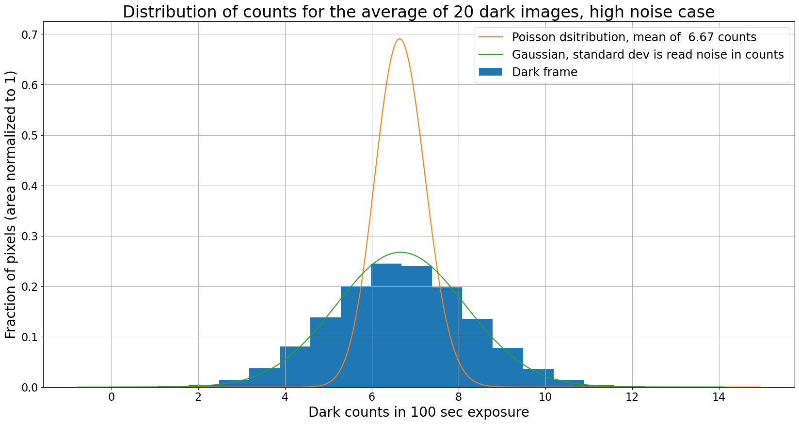

---
redirect_from:
  - "03-01-dark-current-the-ideal-case"
interact_link: content/03-01-Dark-current-The-ideal-case.ipynb
kernel_name: python3
has_widgets: false
title: 'Dark current: the ideal case'
prev_page:
  url: /03-00-Dark-current-and-hot-pixels
  title: 'Dark current and dark frames'
next_page:
  url: /03-02-Real-dark-current-noise-and-other-artifacts
  title: 'Real dark current: noise and other artifacts'
comment: "***PROGRAMMATICALLY GENERATED, DO NOT EDIT. SEE ORIGINAL FILES IN /content***"
---

# Dark current: the ideal case


{:.input_area}
```python
import numpy as np
from scipy import stats

%matplotlib inline
from matplotlib import pyplot as plt

from image_sim import dark_current, read_noise

```


{:.input_area}
```python
# Use custom style for larger fonts and figures
plt.style.use('guide.mplstyle')
```


## A dark frame measures dark current

[*Click here to comment on this section on GitHub (opens in new tab).*](https://github.com/mwcraig/ccd-reduction-and-photometry-guide/pull/104/files#diff-79a39e9fbb1c107179d1f3b0781ce2dfR39){:target="_blank"}

Recall that *dark current* refers to counts (electrons) generated in a pixel
because an electron in the pixel happens to have enough energy to "break free"
and register as a count. The distribution of electron thermal energies in  pixel
follows a [Maxwell-Boltzmann distribution](https://en.wikipedia.org/wiki/Maxwell%E2%80%93Boltzmann_distribution) in which most electrons have energy
around $kT$, where $T$ is the temperature of the sensor and $k$ is the Boltzmann
constant. There is a distribution of energies, though, and occasionally an
electron will be high enough energy to jump to the conducting band in the chip,
registering the same as an electron excited by a photon. Since the
Maxwell-Boltzmann distribution depends on temperature the rate at which dark
current appears in a pixel is also expected to depend on temperature.

A *dark frame* (also called a *dark image*) is an image taken with your camera
with the shutter closed. It is the sum of the bias level of your camera, the
readout noise, and the dark current.

You measure the dark current in your camera by taking dark frames.

### Convenience functions

[*Click here to comment on this section on GitHub (opens in new tab).*](https://github.com/mwcraig/ccd-reduction-and-photometry-guide/pull/104/files#diff-79a39e9fbb1c107179d1f3b0781ce2dfR63){:target="_blank"}

A couple of functions that will be reused a few times in this notebook are
defined below.

**A function to generate dark frames**

This function generates a set of dark frames. It will be used several times
below.


{:.input_area}
```python
def generate_dark_frames(n_frames, 
                         dark_rate=0, 
                         noise=0,
                         gain=1,
                         exposure=10,
                         image_size=500):
    
    base_image = np.zeros([image_size, image_size])
    darks = np.zeros([n_frames, image_size, image_size])
    
    for n in range(n_images):
        darks[n] = dark_current(base_image, dark_rate, exposure, gain=gain, hot_pixels=False)
        if noise > 0:
            darks[n] = darks[n] + read_noise(base_image, noise, gain=gain)

    return darks
```


**A function to plot the distribution of dark counts**

The function below plots the


{:.input_area}
```python
def plot_dark_with_distributions(image, rn, dark_rate, 
                                 n_images=1,
                                 exposure=1,
                                 gain=1,
                                 show_poisson=True, 
                                 show_gaussian=True):
    """
    Plot the distribution of dark pixel values, optionally overplotting the expected Poisson and
    normal distributions corresponding to dark current only or read noise only.
    
    Parameters
    ----------
    
    image : numpy array
        Dark frame to histogram.
    
    rn : float
        The read noise, in electrons.
        
    dark_rate : float
        The dark current in electrons/sec/pixel.
    
    n_images : float, optional
        If the image is formed from the average of some number of dark frames then 
        the resulting Poisson distribution depends on the number of images, as does the 
        expected standard deviation of the Gaussian.
        
    exposure : float
        Exosure time, in seconds.
        
    gain : float, optional
        Gain of the camera, in electron/ADU.
        
    show_poisson : bool, optional
        If ``True``, overplot a Poisson distribution with mean equal to the expected dark
        counts for the number of images.
    
    show_gaussian : bool, optional
        If ``True``, overplot a normal distribution with mean equal to the expected dark
        counts and standard deviation equal to the read noise, scaled as appropiate for 
        the number of images.
    """
    
    h = plt.hist(image.flatten(), bins=20, align='mid', 
                 density=True, label="Dark frame");

    bins = h[1]
    
    expected_mean_dark = dark_rate * exposure / gain
    
    pois = stats.poisson(expected_mean_dark * n_images)

    pois_x = np.arange(0, 300, 1)

    new_area = np.sum(1/n_images * pois.pmf(pois_x))

    if show_poisson:
        plt.plot(pois_x / n_images, pois.pmf(pois_x) / new_area, 
                 label="Poisson dsitribution, mean of {:5.2f} counts".format(expected_mean_dark)) 

    if show_gaussian:
        # The expected width of the Gaussian depends on the number of images.
        expected_scale = rn / gain * np.sqrt(n_images)
        
        # Mean value is same as for the Poisson distribution 
        expected_mean = expected_mean_dark * n_images
        gauss = stats.norm(loc=expected_mean, scale=expected_scale)
        
        gauss_x = np.linspace(expected_mean - 5 * expected_scale,
                              expected_mean + 5 * expected_scale,
                              num=100)
        plt.plot(gauss_x / n_images, gauss.pdf(gauss_x) * n_images, label='Gaussian, standard dev is read noise in counts') 
        
    plt.xlabel("Dark counts in {} sec exposure".format(exposure))
    plt.ylabel("Fraction of pixels (area normalized to 1)")
    plt.grid()
    plt.legend()
```


## Dark current theory

[*Click here to comment on this section on GitHub (opens in new tab).*](https://github.com/mwcraig/ccd-reduction-and-photometry-guide/pull/104/files#diff-79a39e9fbb1c107179d1f3b0781ce2dfR201){:target="_blank"}

The expected signal in a dark frame exposure of time $t$ is proportional to $t$.
If we call the dark electrons in an exposure $d_e(t)$ and the dark current
$d_c(T)$, where $T$ is the temperature, then

$$
d_e(t) = d_c(T) t.
$$

For liquid-cooled cameras, particularly ones cooled by liquid nitrogen, the
operating temperature doesn't change. For thermo-electrically cooled cameras one
is able to set the desired operating temperature. As a result, you should be
able to ignore the temperature dependence of the dark current.

The thermo-electric coolers can usually cool by some fixed amount below the
ambient temperature. Though in principle one could choose to always cool by the
same fixed amount, like $50^\circ$C below the ambient temperature, there is an
advantage to always running your camera at the same temperature: dark frames
taken on one date are potentially useful on another date. If the operating
temperature varies then you need to make sure to take dark frames every time you
observe unless you carefully characterize the temperature dependence of your
dark current.

It will turn out that for practical reasons -- not all pixels in your camera
have the same dark current -- it is usually best to take dark frames every time
you observe anyway.

## Illustration with dark current only

[*Click here to comment on this section on GitHub (opens in new tab).*](https://github.com/mwcraig/ccd-reduction-and-photometry-guide/pull/104/files#diff-79a39e9fbb1c107179d1f3b0781ce2dfR234){:target="_blank"}

For the purposes of illustrating some of the properties of dark current and dark
frames we'll generate some simulated images in which the counts are due to dark
current alone. We'll use these values:

+ Dark current is $d_c(T) = 0.1 e^-$/pixel/sec
+ Gain is $g = 1.5 e^-$/ADU
+ Read noise is 0 $e^-$


{:.input_area}
```python
dark_rate = 0.1
gain = 1.5
read_noise_electrons = 0
```


### Dark current is a random process

[*Click here to comment on this section on GitHub (opens in new tab).*](https://github.com/mwcraig/ccd-reduction-and-photometry-guide/pull/104/files#diff-79a39e9fbb1c107179d1f3b0781ce2dfR260){:target="_blank"}

The dark counts in a dark frame are counts and so they follow a Poisson
distribution. The plot below shows the dark current in a number of randomly
chosen pixels in 20 different simulated images each with exposure time 100 sec.
Note that the counts vary from image to image but that the average is very close
to the expected value.

The expected value of the dark counts for this image are $d_e(t)/g =
6.67~$counts.


{:.input_area}
```python
exposure = 100

n_images = 20
n_pixels = 10
image_size = 500


plt.figure(figsize=(20, 10))

darks = generate_dark_frames(n_images, dark_rate=dark_rate, noise=read_noise_electrons,
                             gain=gain, exposure=100, image_size=image_size)


# Pick several random pixels to plot
pixels = np.random.randint(50, high=190, size=n_pixels)
pixel_values = np.zeros(n_images)
pixel_averages = np.zeros(n_images)

for pixel in pixels:
    for n in range(n_images):
        pixel_values[n] = darks[n, pixel, pixel]
    plt.plot(pixel_values, label='pixel [{0}, {0}]'.format(pixel), alpha=0.5)
    pixel_averages += pixel_values


plt.plot(pixel_averages / n_pixels, 
         linewidth=3,
         label='Average over {} pixels'.format(n_pixels))
# plt.xlim(0, n_images - 1)
plt.hlines(dark_rate * exposure / gain, *plt.xlim(), 
           linewidth=3, 
           label="Expected counts")
plt.xlabel('Image number')
plt.ylabel('Counts due to dark current')

plt.legend()
plt.grid()
```


{:.output .output_png}


### Dark counts follows a Poisson distribution

[*Click here to comment on this section on GitHub (opens in new tab).*](https://github.com/mwcraig/ccd-reduction-and-photometry-guide/pull/104/files#diff-79a39e9fbb1c107179d1f3b0781ce2dfR322){:target="_blank"}

The distribution below shows a normalized histogram of number of pixels as a
function of dark counts in each pixel for one of the simulated dark frames.
Overlaid on the histogram is a Poisson distribution with a mean of $d_e(t_{exp})
= d_C(T) * t_{exp} / g$, where $t_{exp}$ is the exposure time.


{:.input_area}
```python
plt.figure(figsize=(20, 10))


h = plt.hist(darks[-1].flatten(), bins=20, align='mid', density=True, 
             label="Histogram of dark current counts in single image");
bins = h[1]
pois = stats.poisson(dark_rate * exposure / gain)
pois_x = np.arange(0, 20, 1)

plt.plot(pois_x, pois.pmf(pois_x), 
         label="Poisson dsitribution, mean of {:5.2f} counts".format(dark_rate * exposure / gain))  

plt.xlabel("Dark counts in {} exposure".format(exposure))
plt.ylabel("Number of pixels (area normalized to 1)")
plt.legend()
plt.grid()
```


{:.output .output_png}


## Illustration with dark current and read noise

[*Click here to comment on this section on GitHub (opens in new tab).*](https://github.com/mwcraig/ccd-reduction-and-photometry-guide/pull/104/files#diff-79a39e9fbb1c107179d1f3b0781ce2dfR358){:target="_blank"}

Now let's run through the same couple of plots with a non-zero read noise. For
the sake of illustration, we'll look at two cases:

1. Moderate read noise of 10 $e^-$ per read, typical of a low-end research-grade
CCD
2. Low read noise of 1 $e^-$ per read

In both cases we'll continue with the parameters above to generate our frames:

+ Dark current is $d_c(T) = 0.1 e^-$/pixel/sec
+ Gain is $g = 1.5 e^-$/ADU
+ Exposure time 100 sec

With those choices the expected dark count is 6.67 count, which is 10 $e^-$.
That is, not coincidentally, one of the values for read noise that was chosen.

The dark current rate in this example is somewhat higher than that of a real
CCD. A large dark current is used here to demonstrate the interaction of dark
current and read noise, and the exposure time has been chosen that expected dark
electrons is 10$e-$.

### High noise

[*Click here to comment on this section on GitHub (opens in new tab).*](https://github.com/mwcraig/ccd-reduction-and-photometry-guide/pull/104/files#diff-79a39e9fbb1c107179d1f3b0781ce2dfR386){:target="_blank"}

In this first case, the read noise and the dark current are both 10$e^-$. As we
will see shortly, the dark frame really measures read noise, not dark current,
under these circumstances.


{:.input_area}
```python
high_read_noise = 10
```


{:.input_area}
```python
darks = generate_dark_frames(n_images, dark_rate=dark_rate, noise=high_read_noise, 
                             gain=gain, exposure=exposure, image_size=image_size)

image_average = darks.mean(axis=0)
```


{:.input_area}
```python
plt.figure(figsize=(20, 10))

plot_dark_with_distributions(darks[-1], high_read_noise, dark_rate, 
                             n_images=1, exposure=exposure, gain=gain)

plt.xlim(-20, 30);
```


{:.output .output_png}


**This dark frame measures noise, not dark current**

The pixel distribution is clearly a Gaussian distribution with a width
determined by the read noise, not the underlying Poisson distribution that a
dark frame is trying to measure. The only way around this (assuming the dark
current is large enough that it needs to be subtracted at all) is to make the
exposure long enough that the expected counts exceed the dark current.

We explore that case below by adding in a much smaller amount of noise.

**Combining does not recover the dark current**

The plots below show the result of averaging several (20 in this case) dark
frames together. One might hope that averaging reduces the noise enough that the
distribution of pixels becomes the Poisson distribution expected for a dark
frame. It does not.

*Note:* To correctly calculate the expected distribution of counts in the
average of the dark frames one should start with the expectations for the *sum*
of the images, them scale counts down by the number of images and the
distribution up by the same factor so that the distribution remains normalized.


{:.input_area}
```python
plt.figure(figsize=(20, 10))

plot_dark_with_distributions(image_average, high_read_noise, dark_rate, 
                             n_images=20, exposure=exposure, gain=gain)

plt.title("Distribution of counts for the average of 20 dark images, high noise case");
```


{:.output .output_png}



Even the combination of 20 dark frames doesn't lead to a Poisson distribution;
the distribution is still a Gaussian whose width is determined by the read noise
and the number of images.

### Low noise

[*Click here to comment on this section on GitHub (opens in new tab).*](https://github.com/mwcraig/ccd-reduction-and-photometry-guide/pull/104/files#diff-79a39e9fbb1c107179d1f3b0781ce2dfR494){:target="_blank"}

In this case the read noise is 1 $e^-$, lower by a factor of ten than the
expected dark current for this exposure time, 10$e^-$.

This case almost never occurs in real CCDs but it illustrates that with a low
enough read noise one can recover the Poisson distribution of the dark current.


{:.input_area}
```python
low_read_noise = 1

darks = generate_dark_frames(n_images, dark_rate=dark_rate, noise=low_read_noise, 
                             gain=gain, exposure=exposure, image_size=image_size)

image_average = darks.mean(axis=0)
```


{:.input_area}
```python
plt.figure(figsize=(20, 10))


plot_dark_with_distributions(darks[-1], low_read_noise, dark_rate, 
                             n_images=1, exposure=exposure, gain=gain)

#plt.ylim(0, 0.8)
plt.xlim(-10, 20)
plt.title("Distribution of counts for the average of one dark images, low noise case");
```


{:.output .output_png}


{:.input_area}
```python
plt.figure(figsize=(20, 10))


plot_dark_with_distributions(image_average, low_read_noise, dark_rate, 
                             n_images=20, exposure=exposure, gain=gain)

plt.ylim(0, 0.8)
plt.xlim(0, 14)
plt.title("Distribution of counts for the average of 20 dark images, low noise case");
```


{:.output .output_png}


**Dark frame is measuring dark current**

Unlike the high noise case, the pixels in a single low-noise dark frame follow
the Poisson distribution expected for the dark current in this simulated camera.
When multiple images are combined the pixels still follow the Poisson
distribution, as expected in this case.
